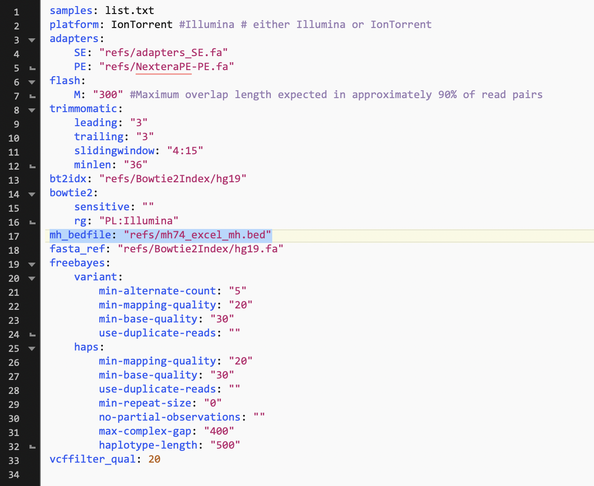

# FONtANA: FOrensic Next-generation ANAlysis
## Forensics Microhaplotype Pipeline
### For Daniele Podini's Forensic Lab
---
---

<br />

## Beginning - Prior to running FONtANA
Please see [Colonial One's help page](https://colonialone.gwu.edu/getting-access/). For working through the terminal, please complete the [Codecademy's Command Line Tutorial](https://www.codecademy.com/learn/learn-the-command-line). For help related to GW's HPC (Colonial One), please see [our help page](https://gwcbi.github.io/HPC/).


<br />

### Beginning on Colonial One
See Colonial One's [wiki page](https://colonialone.gwu.edu/available-filesystems/). You will run *all* FONtANA related stuff on `lustre` (**NOT** your home directory). You can access `lustre` by such: `cd /lustre/podinigrp`.

You will then want to create a directory for each person individually. Do so by doing `mkdir -p $name`, so for example I would do `mkdir -p kgibson` and now I would have a directory named `kgibson` in this directory.

#### Starting:

See this [help page](https://colonialone.gwu.edu/quick-start/). Where it shows `$name` insert your colonialone id. Mine is `kmgibson`.

```
# here we are logging into Colonial one
ssh $name@login.colonialone.gwu.edu
$enter_password

# here we are moving into the correct directory
cd /lustre/groups/podinigrp 

# here we are creating a directory for you and creating a samples directory
mkdir -p $name/fontana

cd $name
```

## Downloading FONtANA repository from github.
We need to download all the snakemake files and other files from github. See [here](https://www.git-tower.com/learn/git/commands/git-clone) for help on cloning an existing repository.

```
# make sure you are in the correct folder. Your folder
pwd 

# should be in /$name directory. If not, move there.
git clone git@github.com:kmgibson/FONTANA.git fontana

cd fontana
ls
```


---
## Downloading/Uploading data to Colonial One

1. Download the `BAM` files for the IonTorrent data from the server.
2. Upload them to Colonial One like so:
This is done on your own computer. Not within Colonial One.

```
# Example:
rsync -P -av "MP" kmgibson@login3.colonialone.gwu.edu:/lustre/groups/podinigrp/kgibson/fontana/samples

```

This is saying upload directory "MP" to Colonial One at this location. You will need to change the directory name to whatever yours is and change kgibson to whatever your Colonial One ID is. So fill in $name and $directory in the one below:

```
rsync -P -av "$directory" $name@login3.colonialone.gwu.edu:/lustre/groups/podinigrp/$name/fontana/samples
```

If you have done this successfully, your files on your computer in `$directory` will be uploaded to Colonial One under the directory `samples`.

3. Getting a list of all samples, renaming the files and creating a directory for each sample.

```
# here we are creating a directory for you and creating a samples directory
pwd # you should be in fontana directory
mkdir -p samples
cd samples

module load samtools

for f in *.bam; do 
    name=$(echo $f |awk -F[_.] '{print $2}')
    samp=$(samtools view -H $f | grep "SM:" | cut -f10 | sort | uniq | awk -F[:.] '{print $2}')
    echo -e "${name}\t${samp}" >> dirsamp.txt # this gets a list of all samples
    echo $f
done

# view this list
cat dirsamp.txt

# this loop creates directories and renames the file
for f in *.bam; do
    name=$(echo $f |awk -F[_.] '{print $2}')
    samp=$(samtools view -H $f | grep "SM:" | cut -f10 | sort | uniq | awk -F[:.] '{print $2}' | cut -d " " -f1)
    echo -e "$f\t$name\t$samp"
    mkdir -p Ion_${name}_${samp}
    mv $f Ion_${name}_${samp}
    mv Ion_${name}_${samp}/$f Ion_${name}_${samp}/original.bam
done

# creates a list of just the directory names. This file is used in FONtANA.
ls -d Ion_* > ../list.txt
rm dirsamp.txt
```

---

Your directory structure should now look like such:

```
/lustre/podinigrp/$name/fontana/
    ├── samples
    │   ├── Ion_$samp1
    |   |   ├── original.bam
    │   └── Ion_$samp2
    |       └── original.bam
    ├── refs
    │   ├── NexteraPE-PE.fa
    │   └── adapters_SE.fa
    ├── envs
    │   ├── haplotype.yaml
    │   ├── processIllumina.yaml
    │   ├── processIonTorrent.yaml
    │   └── references.yaml
    ├── scripts
    │   ├── checkbamoutput.sh
    │   └── filter_spanning_reads.py
    ├── Snakefile
    ├── Snakefile.haplotype
    ├── Snakefile.processIllumina
    ├── Snakefile.processIonTorrent
    ├── Snakefile.references
    ├── environment.yaml
    ├── config.yaml
    └── README.md
```


---

## Installing FONtANA
We need to create a new conda environment for FONtANA. See [here](https://bioconda.github.io/user/install.html) for information regarding bioconda. See [here](https://docs.conda.io/projects/conda/en/latest/user-guide/concepts/channels.html) for information about conda channels.

```
# load modules you will use.
module use /groups/podinigrp/shared/modulefiles
module unload python
module load miniconda3/4.3.27.1

# set conda channels.
conda config --add channels defaults
conda config --add channels bioconda
conda config --add channels conda-forge

# create conda enironment.
conda create --name fontana --file environment.yaml

```

---

## Starting FONtANA

1. Get an interactive node.
You need to allocate a node for yourself, because I have not made this automatic (into a job) yet. See this [help page](https://github.com/gwcbi/HPC/blob/master/interactive_jobs.md) for getting an interactive node.

Basic commands are below. You can replace the `defq` option with either `short` or `debug`.

```
# look for idle nodes.
sinfo

# request a node
salloc -p defq -N 1 -t 500

 # find the node you got
squeue

# insert number where $num is, the number is on the allocated node you obtained.
ssh node$num

# You need to move back to the correct directory
cd /lustre/podinigrp/$name/
```

2. Loading an environment for FONtANA.

```
module use /groups/podinigrp/shared/modulefiles
module unload python
module load miniconda3/4.3.27.1

source activate fontana

# if that ^^ didn't work. Try:
# conda activate fontana

```

3. Editing the `config.yaml` file for your preferences and files.

```
# view the config.yaml file
cat config.yaml
```

You should see something like this:


You will need to replace the bedfile listed here with whatever bedfile you would like to use. I have put two that I have been using in the `refs` directory if you would like to use them.

A bedfile should look like this. For more information regarding bedfiles, see [here](https://useast.ensembl.org/info/website/upload/bed.html), [here](https://www.genomatix.de/online_help/help_regionminer/bedformat_help.html), [here](https://bedtools.readthedocs.io/en/latest/content/general-usage.html) or [here](https://genome.ucsc.edu/FAQ/FAQformat.html#format1):

```
chr#	start_pos		end_pos	MH_name	score	strand_direction	.	track_lines
```

Example:

```
chr1	1486826	1487087	mh01KK-172	0	+	.	GENE_ID=SP_1.27585
chr1	216634369	216634540	mh01kk-002	0	+	.	GENE_ID=SP_5.6236
chr2	228092294	228092491	mh02KK-136	0	+	.	GENE_ID=SP_29.8907
chr9	135862470	135862637	mh09KK-157	0	+	.	GENE_ID=SP_45.18475

```


 
4. Testing to see what FONtANA will run

A dry run of FONtANA, to see what the program is going to do, and if your samples are set up correctly. Make sure this dryrun finishes correctly (all green text and no errors thrown).

```
snakemake --use-conda --dryrun
```

Running FONtANA:

```
snakemake --use-conda 
```

<br />
<br />
<br />

---
---

/groups/podinigrp/shared/apps/miniconda3/4.3.27.1
<br />


---

#### For Future:
Create documentation with https://readthedocs.org/
